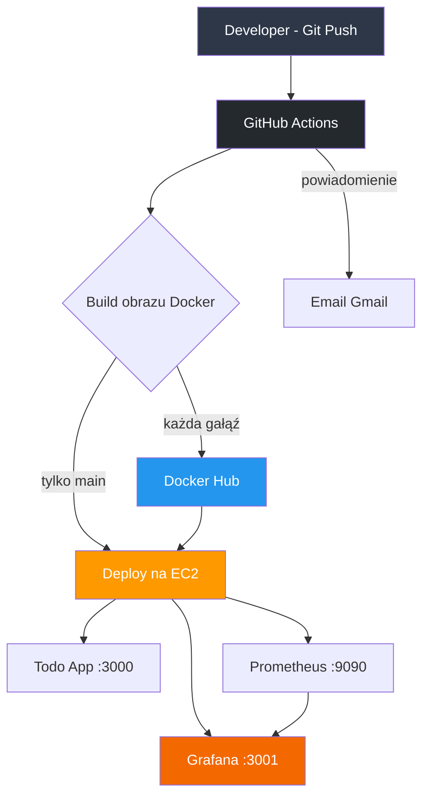
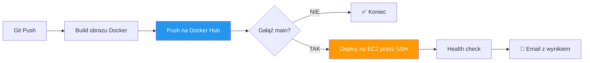

# 🚀 Final DevOps Project


To mój pierwszy większy projekt DevOps — zbudowany od zera w ramach projektu dyplomowego po około 5 miesiącach nauki. Aplikacja Todo App na Node.js z pełnym pipeline'em CI/CD, infrastrukturą na AWS zarządzaną przez Terraform, konfiguracją serwera przez Ansible i monitoringiem Prometheus + Grafana.

Projekt powstał żeby pokazać w praktyce jak działa nowoczesny pipeline DevOps — od commita do działającej aplikacji na produkcji.

---

## 📋 Spis treści

- [Architektura](#architektura)
- [Stos technologiczny](#stos-technologiczny)
- [Struktura projektu](#struktura-projektu)
- [Jak to uruchomić](#jak-to-uruchomić)
- [CI/CD Pipeline](#cicd-pipeline)
- [API](#api)
- [Monitoring](#monitoring)
- [Ansible](#ansible)
- [Bezpieczeństwo](#bezpieczeństwo)
- [Koszty](#koszty)

---

## 🏗️ Architektura


---

## 🛠️ Stos technologiczny

| Kategoria | Technologia |
|-----------|-------------|
| Aplikacja | Node.js + Express |
| Frontend | HTML / CSS / JavaScript |
| Konteneryzacja | Docker |
| Rejestr obrazów | Docker Hub |
| Infrastruktura (IaC) | Terraform |
| Konfiguracja serwera | Ansible |
| Chmura | AWS EC2 (eu-central-1) |
| CI/CD | GitHub Actions |
| Powiadomienia | Gmail SMTP |
| Monitoring | Prometheus + Grafana + Node Exporter |

---

## 📁 Struktura projektu
```
final-devops-project/
├── app/                        # Aplikacja Node.js
│   ├── public/
│   │   └── index.html          # Frontend
│   ├── index.js                # Serwer Express + REST API
│   ├── package.json
│   └── Dockerfile
├── terraform/                  # Infrastruktura jako kod
│   ├── main.tf                 # Provider AWS + backend S3
│   ├── variables.tf
│   ├── outputs.tf
│   ├── vpc.tf                  # VPC, Subnet, Internet Gateway
│   ├── security.tf             # Security Groups
│   └── ec2.tf                  # Instancja EC2
├── ansible/                    # Konfiguracja serwera
│   ├── playbook.yml
│   └── inventory.ini
├── monitoring/                 # Prometheus + Grafana
│   ├── prometheus.yml
│   └── docker-compose.yml
└── .github/workflows/
    └── ci-cd.yml               # Pipeline CI/CD
```

---

## 🚀 Jak to uruchomić

### Wymagania
- AWS CLI skonfigurowane (`aws configure`)
- Terraform >= 1.0
- Docker
- Ansible >= 2.16

### Krok 1 — S3 bucket dla stanu Terraform
```bash
aws s3api create-bucket \
  --bucket devops-terraform-state-fmagiera \
  --region eu-central-1 \
  --create-bucket-configuration LocationConstraint=eu-central-1
```

### Krok 2 — Infrastruktura na AWS
```bash
cd terraform
terraform init
terraform plan   # podgląd zmian
terraform apply  # wdrożenie
```

Terraform zwróci publiczne IP serwera.

### Krok 3 — Konfiguracja serwera
```bash
cd ansible
ansible-playbook -i inventory.ini playbook.yml
```

Ansible zainstaluje Dockera, Node Exportera i uruchomi aplikację.

### Krok 4 — Monitoring
```bash
ssh -i ~/.ssh/id_ed25519 ec2-user@<EC2_IP>
cd ~/monitoring
docker-compose up -d
```

### Krok 5 — CI/CD
Skonfiguruj GitHub Secrets w repozytorium:

| Secret | Opis |
|--------|------|
| `DOCKERHUB_USERNAME` | Nazwa użytkownika Docker Hub |
| `DOCKERHUB_TOKEN` | Token dostępu Docker Hub |
| `EC2_HOST` | Publiczny IP serwera EC2 |
| `EC2_USER` | Użytkownik SSH (ec2-user) |
| `EC2_SSH_KEY` | Prywatny klucz SSH |
| `AWS_ACCESS_KEY_ID` | Klucz AWS |
| `AWS_SECRET_ACCESS_KEY` | Sekret AWS |
| `SES_SMTP_USERNAME` | Adres Gmail |
| `SES_SMTP_PASSWORD` | App Password Gmail |
| `NOTIFY_EMAIL` | Adres docelowy powiadomień |
| `SES_DOMAIN` | Domena (gmail.com) |

Od tego momentu każdy `git push` na `main` automatycznie deployuje aplikację.

---

## ⚙️ CI/CD Pipeline


Każdy commit na dowolną gałąź buduje i publikuje obraz Docker.
Tylko commit na `main` deployuje aplikację na serwer produkcyjny.

---

## 🔌 API

| Metoda | Endpoint | Opis |
|--------|----------|------|
| GET | `/` | Frontend aplikacji |
| GET | `/api` | Informacje o API + linki do monitoringu |
| GET | `/health` | Health check |
| GET | `/todos` | Lista zadań |
| POST | `/todos` | Dodaj zadanie |
| PUT | `/todos/:id` | Zmień status zadania |
| DELETE | `/todos/:id` | Usuń zadanie |

---

## 📊 Monitoring

| Serwis | Port | Opis |
|--------|------|------|
| Todo App | 3000 | Aplikacja |
| Prometheus | 9090 | Zbieranie metryk co 15 sekund |
| Grafana | 3001 | Dashboardy (admin / devops123) |
| Node Exporter | 9100 | Metryki systemowe EC2 |

Prometheus odpytuje Node Exportera co 15 sekund i zbiera metryki CPU, RAM, dysku i sieci. Grafana wizualizuje te dane w dashboardzie Node Exporter Full (ID: 1860).

---

## 🤖 Ansible

Ansible automatyzuje konfigurację serwera EC2 po jego postawieniu przez Terraform. Playbook jest idempotentny — można go uruchomić wielokrotnie z tym samym efektem.
```bash
cd ansible
ansible-playbook -i inventory.ini playbook.yml
```

---

## 🔒 Bezpieczeństwo

- Klucze SSH do autoryzacji na EC2
- Sekrety przechowywane w GitHub Secrets — nie ma żadnych danych wrażliwych w kodzie
- Stan Terraform w S3 — dostępny tylko dla autoryzowanych użytkowników AWS
- Security Groups otwierają tylko niezbędne porty

---

## 💰 Koszty

Projekt działa w całości na **AWS Free Tier** — EC2 t3.micro (750h/miesiąc), S3 (5GB). Całkowity koszt: $0.

> ⚠️ Po zakończeniu projektu: `terraform destroy` — jeden command niszczy całą infrastrukturę.

---

## 👤 Autor

Filip Magiera — projekt dyplomowy, 2026
